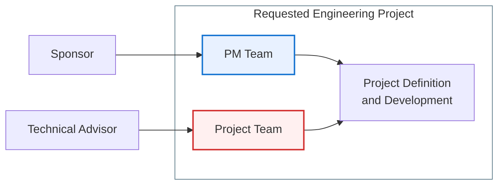

---
# try also 'default' to start simple
theme: seriph
# random image from a curated Unsplash collection by Anthony
# like them? see https://unsplash.com/collections/94734566/slidev
background: https://cover.sli.dev
# some information about your slides (markdown enabled)
title: Welcome to TBDA Course
info: |
  ## Slidev Starter Template
  Presentation slides for course participants.

  Learn more at [Sli.dev](https://sli.dev)
# apply UnoCSS classes to the current slide
class: text-center
# https://sli.dev/features/drawing
drawings:
  persist: false
# slide transition: https://sli.dev/guide/animations.html#slide-transitions
transition: slide-left
# enable Comark Syntax: https://comark.dev/syntax/markdown
comark: true
# duration of the presentation
duration: 35min
---

# Welcome to DPA
Presentation slides

  Press Space for next page <carbon:arrow-right />

  <button @click="$slidev.nav.openInEditor()" title="Open in Editor" class="slidev-icon-btn">
    <carbon:edit />
  </button>
  <a href="https://github.com/slidevjs/slidev" target="_blank" class="slidev-icon-btn">
    <carbon:logo-github />
  </a>

<!--
The last comment block of each slide will be treated as slide notes. It will be visible and editable in Presenter Mode along with the slide. [Read more in the docs](https://sli.dev/guide/syntax.html#notes)
-->

---
title: About myself
layout: default
transition: fade-out
background: ./images/Designer.png
backgroundSize: cover
---

<AboutMe />

---
title: DPA Course Presentation
layout: default
transition: fade-out
background: ./images/Designer.png
backgroundSize: cover
---

## Modalities

### Context

The Advanced Project Management course offers students different learning modalities to align with their specific interests, primarily dividing into 

- a research profile and 
- a practical or professional profile. 

Students are asked to select their preferred track during the first week of the course, and if no choice is made, they are automatically assigned to the practical track. The practical modality places a strong emphasis on the real-world dimension of managing a project team. In this track, students focus on the comprehensive management of an engineering team, taking responsibility for critical project areas such as scope definition, effort estimation, risk management, configuration management, and documentation. To simulate a genuine professional environment, project management teams may be assigned to manage a group of undergraduate students working on a project, or they might handle auditing processes for other ongoing teams.

### Practical Modality

Regarding how the practical modality functions in terms of effort, the course demands significant daily tracking and continuous involvement. The methodology is heavily driven by a **flipped classroom** approach, meaning that the theoretical learning of concepts and tools is completed asynchronously and individually by each student outside of standard class hours. Synchronous sessions are then dedicated to collaborative reviewing concepts rather than traditional lectures. These synchronous classes involve analyzing the progress of the practical cases, engaging in gamification activities to test the knowledge acquired during individual study, and resolving specific questions. Furthermore, teams working on the practical case are required to maintain a high level of continuous effort by publishing a weekly professional summary on a blog, detailing their activities, problems encountered, and achievements.
The grading structure for this continuous evaluation modality reflects the balance between individual theoretical understanding and collaborative practical application. The evaluation is composed of individual knowledge components, which account for fifty-five percent of the final grade, and practical group activities, which make up the remaining forty-five percent. The individual assessment includes gamification questions, theoretical questions directly linked to the flipped classroom method, and contributions to management deliverables. Meanwhile, the forty-five percent dedicated to the practical work evaluates the continuous project management tasks, the final document, and the visual presentation. It is important to note that the practical group work cannot be retaken in extraordinary examination periods because it is developed continuously within real-world contexts and team dynamics.

---
title: TBDA Course Presentation
layout: default
transition: fade-out
background: ./images/Designer.png
backgroundSize: cover
---

### Notes

<v-clicks>

- 📝 Be aware of the **flipped classroom** approach
- 🎥 Keep in mind you must know all concepts related to **Project Engieneering**, such as (*official documents and their legal value, Budget estimation vs cost, P&IDs, read technical drawings*, etc.). If it is not your case, review the materials from Projects undergrad course, but do not go forward without it.
- 🛠 Make sure **you have the time to be spent** into the course. Otherwise you will damage yourself and your team as well.
- ✅ Go to the ["moodle webpage"](https://moodle.upm.es/titulaciones/oficiales2627/course/view.php?id=388) and get yourself registered (Password: **MIO#2627**)
- Choose between: Managing an <strong>engineering project</strong> or Conducting research activities on project management.
- ⚠️ Then, go to the course and select your Modality *when not the practical one*.
- 🚀 There will be five teams in competition. **Teams will be built by the advisor**. They will be on purpose different from MwAI course. Please, register yourself asap.
</v-clicks>

---
title: "Team Structure and Time Frame"
layout: default
transition: fade-out
---

- The Project Management Team comprises <strong>10-12 people</strong>.
- Each PM Team must include <strong>fewer than three international students</strong>, and team composition must be balanced.
- The <strong>engineering project</strong> must be developed in less than four months.
- The expected scope is the <strong>general design and its justification</strong>.
- The Project Team will include approximately <strong>10–15 additional people</strong>, focused on engineering work.
- Theory will end by <strong>Dec 4th</strong>.

### Management dimensions of the project

- Schedule, quality, risk and configuration.
- Resources.
- Reporting.
- Communications.

### Manage the people doing the work

- Manage the complete project and its subteams.
- Low-level management of the Project Team is mandatory.
- Management does not mean doing the engineering work; it means steering the people who do it, which means that you must know what to do yourself.

---
title: "About the Project Itself"
layout: default
transition: fade-out
---

- The proposed scope is fixed. If you have an alternative proposal, submit it for consideration.
- The project must be related to the <strong>Sustainable Development Goals (SDGs)</strong>.
- It must have a meaningful impact on society.
- It must be feasible for the team within the allocated time frame.
- Implementation is not required, but it must be planned.
- It must be related to the <strong>EELISA initiative</strong>.

<v-clicks>

  <iframe
    width="533"
    height="300"
    src="https://www.youtube.com/embed/BM9uyrYZJts"
    title="The EELISA initiative"
    frameborder="0"
    allow="accelerometer; autoplay; clipboard-write; encrypted-media; gyroscope; picture-in-picture; web-share"
    allowfullscreen>
  </iframe>

</v-clicks>

---
title: "Project Execution"
layout: default
transition: fade-out
---

- The instructor will act as the <strong>Sponsor</strong> by default.
- The instructor will also act as a consultant—but only <strong>when requested by the team</strong>.
- Make sure that the <strong>Business Case</strong> clearly describes the relevant project conditions and assumptions.

---
title: "Theoretical Context"
layout: default
transition: fade-out
---

- Theory provides context for the decisions you need to make.
- <strong>Theory is not the core of this course, but it's still relevant.</strong>
- Theory will be approached through a <strong>flipped-classroom</strong> model.
- Learning will follow a <strong>microlearning and team-based learning</strong> scheme.
- Knowledge sections will be assessed through questionnaires.
- Individual progress may be asynchronous, but assessment is not.

- A <strong>flipped classroom</strong> does not mean that you are alone. However, you must work through the concepts <strong>before class</strong>.
- Use the <strong>course forum</strong> to raise your questions. Remember: <strong>participation is required</strong>.
- You are encouraged to answer your classmates whenever you can; otherwise, the instructor will respond. This participation contributes to your score.
- Learning is valuable when it enables better products or decisions. <strong>Stay focused on this purpose.</strong>
- Your concepts and analyses will be tested in practice.
- Failure can produce powerful learning—but do not fail too often.
- Learning happens both in and outside class. Use class time to clarify doubts and discuss cases.

---
title: "Assessment Criteria"
layout: default
transition: fade-out
---

1. Quality is related to the <strong>complete and consistent set</strong> of project deliverables, including <strong>all</strong> required ones.
2. Dissemination.
3. Communication management.
4. Project control and team building.
5. <strong>Stakeholder satisfaction.</strong>
6. The average of the most successful 85% of theory quizzes, provided that they are properly completed <strong>by the entire team</strong>.
7. Participation in forum questions and answers.
8. You are part of the evaluation committee for the Engineering Team as well (You must insert the email of the member and score their work).
9. The Engineering Team will also assess your steering and management work.
10. The quality of their deliverables will also affect your score.
11. Traceability for **who did what when** is a must.

---
title: "Assessment Criteria"
layout: default
transition: fade-out
---

